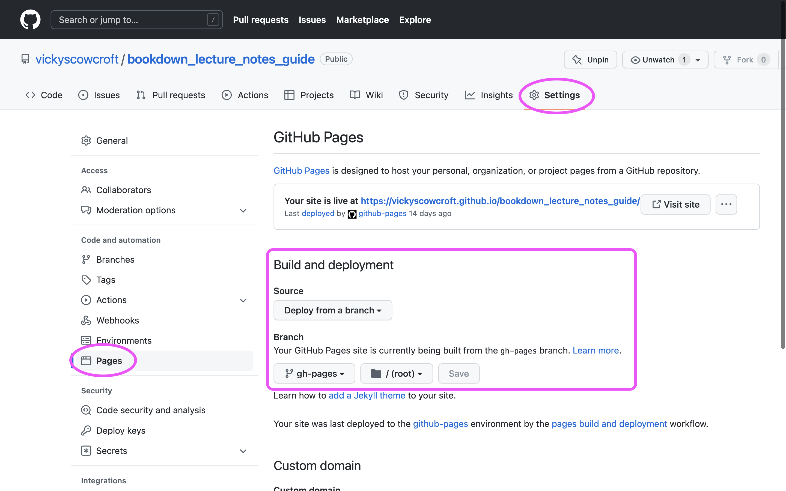
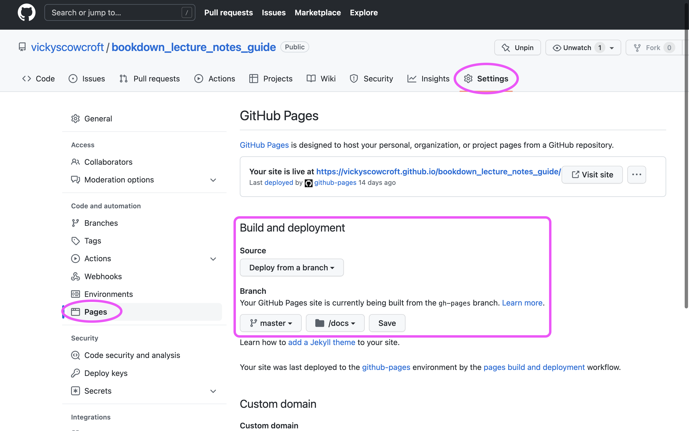
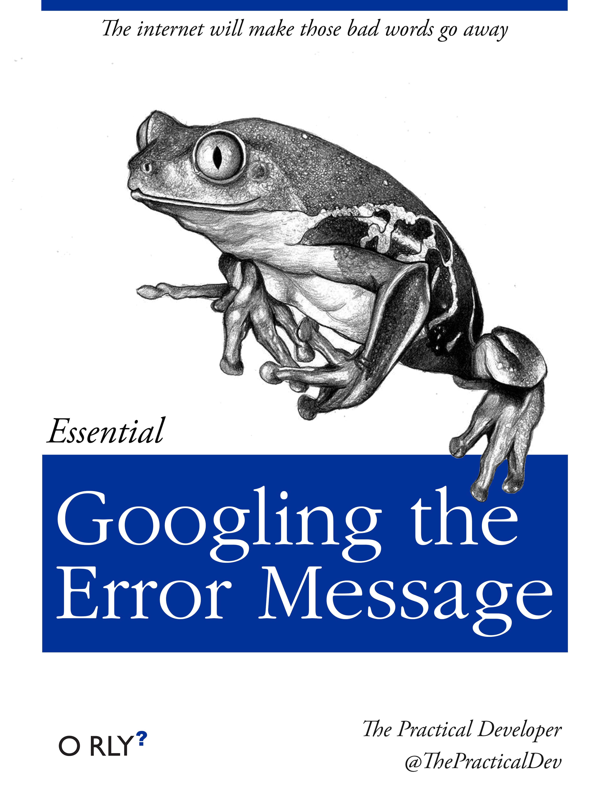
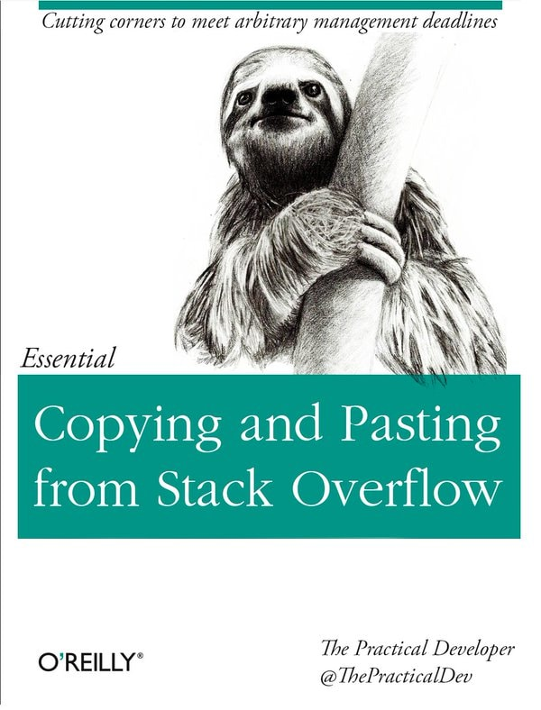

## Overview

-   What is GitHub?
-   What is GitHub pages?
-   GitHub vs Moodle
-   How it works in practice

## What is GitHub? {.center}

> [github.com](github.com) is an online hosting service for software development and version control
>
> ::: rightbit
> --- [Wikipedia: GitHub](https://en.wikipedia.org/wiki/GitHub)
> :::

. . .

::: commentsub
Why is this useful for lecture notes??
:::

## Why is this useful?

{.absolute top="0" right="0" width="377"}

. . .

-   **Version control**
    -   Keeps all previous versions
        -   (assuming you've uploaded them...)
    -   Can 'roll-back' to previous versions.

. . .

-   **Collaboration**
    -   Can collaborate without file editing clashes.

    -   Pick and choose which changes to keep.

{.absolute bottom="0" right="0" width="300"}

. . .

::: {.commentsub style="text-align: left !important;"}
Basic intro to GitHub [here](https://github.com/skills/introduction-to-github)
:::

::: {.commentsub style="text-align: left !important;"}
Intro to GitHub pages [here](https://github.com/skills/github-pages)
:::

## Why use GitHub when we have Moodle? {.center}

## Github pages vs Moodle

+-------------------------------------+-----------------------------------------+
| GitHub pages                        | Moodle                                  |
+=====================================+========================================:+
| Externally visible                  | Visibility limited by course access     |
+-------------------------------------+-----------------------------------------+
| Initial set-up can be faffy         | Initial set up done centrally           |
+-------------------------------------+-----------------------------------------+
| Built-in version control            | Updates remove previous version^1^      |
+-------------------------------------+-----------------------------------------+
| Easy^2^ to make incremental changes | Changes require re-uploading everything |
+-------------------------------------+-----------------------------------------+

: { #tab-moodle-gh tbl-colwidths="\[50,50\]"}

::: aside
^1^ I *think* you can roll-back to the latest Moodle back-up??

^2^ Incremental changes are *usually* easy on GitHub, until something goes wrong. Then [Stack Overflow](https://stackoverflow.com/) is your best bet.
:::

. . .

{.absolute bottom="100" left="300" width="377"}

## Setting up

Assuming you already have an account on GitHub (or Bath GitHub) and you've set up your credentials:

+----------------------------------------------------------------+---------------------------------------+
| Step                                                           | Command                               |
+================================================================+=======================================+
| Create repository                                              | `git init`                            |
+----------------------------------------------------------------+---------------------------------------+
| Create/edit content                                            |                                       |
+----------------------------------------------------------------+---------------------------------------+
| Add files you want to commit                                   | All files with changes: `git add -A`  |
|                                                                |                                       |
|                                                                | Individual files: `git add $filename` |
+----------------------------------------------------------------+---------------------------------------+
| Commit your files to be uploaded and say what your changes are | `git commit -m "your message here"`   |
+----------------------------------------------------------------+---------------------------------------+
| Push files to GitHub                                           | `git push`                            |
+----------------------------------------------------------------+---------------------------------------+

: { #tab-gh-steps tbl-colwidths="\[40,60\]"}

## Publishing using `gh-pages` branch {.scrollable}

-   Needs an extra step to publish after upload
-   Gives more control over what is published (and when)

. . .

-   **1^st^ time only:**
    -   Set up `gh-pages` branch

        {width="960"}

    -   Clone this branch into a new folder:

<!-- -->

    git clone -b gh-pages $repo-path book-output

`$repo-path` is the location of the repository on github, e.g. `https://github.com/your_user_name/lecture_notes.git`

. . .

-   Then:

<!-- -->

    cd book-output
    cp -r ../_book/* ./
    git add --all *
    git commit -m "Update the book" || true
    git push -q origin gh-pages

assuming your bookdown book is in a folder called `_book`

## Publishing using `docs` folder {.scrollable}

-   Will automatically update content every time you commit changes
-   A bit less control over what is published (and when)

. . .

-   Set up GitHub pages to generate automatically from the `docs` folder

    {width="960"}

. . .

-   Rename/copy your `_book` folder to `docs`
-   `git add`, `commit`, and `push` the main repository as normal.

## How to publish on Moodle

1.  Compress your `_book` file to `_book.zip`
2.  Upload the file to Moodle
3.  Unzip the file
4.  Set `index.html` as the main file

-   Should now see a link to your document on Moodle.

. . .

::: commentsub
What's annoying about this?
:::

. . .

-   You have to replace the **whole document** to make any changes.
-   Doesn't seem to be a way to update incrementally (very easily).

## Summary

-   Version control is good for you

. . .

-   Using GitHub is easier than you may think

. . .

-   If you get stuck, someone on Stack Overflow has probably already solved the same problem

. . .

{.absolute bottom="0" left="0" width="267"}

{.absolute bottom="0" right="0" width="266"}

{.absolute bottom="0" left="400" width="267"}
